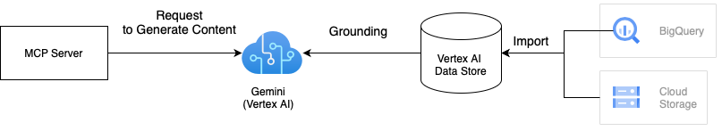

[](https://mseep.ai/app/ubie-oss-mcp-vertexai-search)

# MCP Server for Vertex AI Search

This is a MCP server to search documents using Vertex AI.

## Architecture

This solution uses Gemini with Vertex AI grounding to search documents using your private data.
Grounding improves the quality of search results by grounding Gemini's responses in your data stored in Vertex AI Datastore.
We can integrate one or multiple Vertex AI data stores to the MCP server.
For more details on grounding, refer to [Vertex AI Grounding Documentation](https://cloud.google.com/vertex-ai/generative-ai/docs/multimodal/ground-with-your-data).



## How to use

There are two ways to use this MCP server.
If you want to run this on Docker, the first approach would be good as Dockerfile is provided in the project.

### 1. Clone the repository

```shell
# Clone the repository
git clone git@github.com:ubie-oss/mcp-vertexai-search.git

# Create a virtual environment
uv venv
# Install the dependencies
uv sync --all-extras

# Check the command
uv run mcp-vertexai-search
```

### Install the python package

The package isn't published to PyPI yet, but we can install it from the repository.
We need a config file derives from [config.yml.template](./config.yml.template) to run the MCP server, because the python package doesn't include the config template.
Please refer to [Appendix A: Config file](#appendix-a-config-file) for the details of the config file.

```shell
# Install the package
pip install git+https://github.com/ubie-oss/mcp-vertexai-search.git

# Check the command
mcp-vertexai-search --help
```

## Development

### Prerequisites

- [uv](https://docs.astral.sh/uv/getting-started/installation/)
- Vertex AI data store
  - Please look into [the official documentation about data stores](https://cloud.google.com/generative-ai-app-builder/docs/create-datastore-ingest) for more information

### Set up Local Environment

```shell
# Optional: Install uv
python -m pip install -r requirements.setup.txt

# Create a virtual environment
uv venv
uv sync --all-extras
```

### Run the MCP server

This supports two transports for SSE (Server-Sent Events) and stdio (Standard Input Output).
We can control the transport by setting the `--transport` flag.

We can configure the MCP server with a YAML file.
[config.yml.template](./config.yml.template) is a template for the config file.
Please modify the config file to fit your needs.

```bash
uv run mcp-vertexai-search serve \
    --config config.yml \
    --transport <stdio|sse>
```

### Test the Vertex AI Search

We can test the Vertex AI Search by using the `mcp-vertexai-search search` command without the MCP server.

```bash
uv run mcp-vertexai-search search \
    --config config.yml \
    --query <your-query>
```

## Appendix A: Config file

[config.yml.template](./config.yml.template) is a template for the config file.

- `server`
  - `server.name`: The name of the MCP server
- `model`
  - `model.model_name`: The name of the Vertex AI model
  - `model.project_id`: The project ID of the Vertex AI model
  - `model.location`: The location of the model (e.g. us-central1)
  - `model.impersonate_service_account`: The service account to impersonate
  - `model.generate_content_config`: The configuration for the generate content API
- `data_stores`: The list of Vertex AI data stores
  - `data_stores.project_id`: The project ID of the Vertex AI data store
  - `data_stores.location`: The location of the Vertex AI data store (e.g. us)
  - `data_stores.datastore_id`: The ID of the Vertex AI data store
  - `data_stores.tool_name`: The name of the tool
  - `data_stores.description`: The description of the Vertex AI data store
